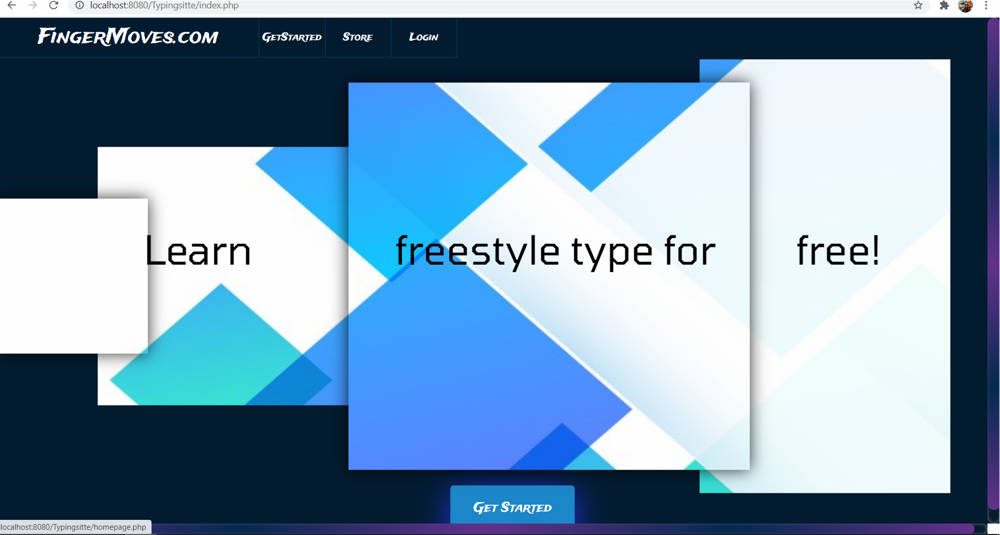
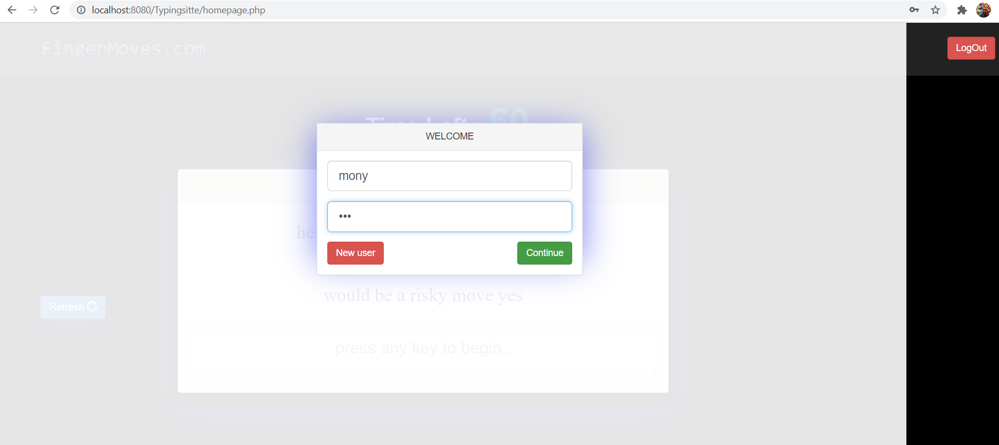
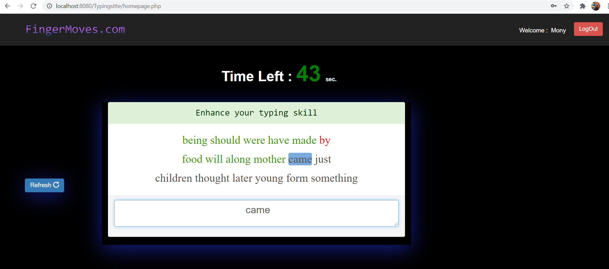
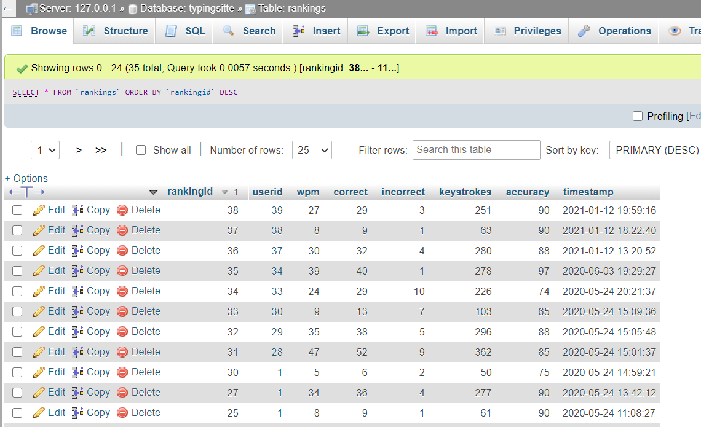

# Typingsitte
A simple touch-typing site

The way of processing the database is in the file "dumpdatabase". But first, attributes need to be created as shown in the file.

I run this program using 'xampp'. So, it is needed to download xampp or any other servers to run this program.
Link to the video of this site is attached above in the link section.

Output in image-format:

